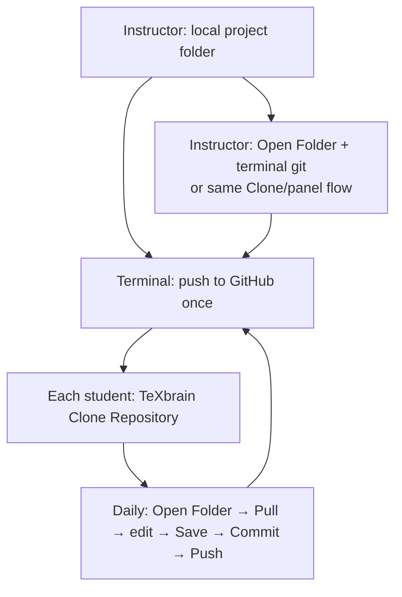

<p align="right"><a href="../README.md">Docs index</a> · <a href="../../README.md">Main README</a> · <a href="../zh-CN/collaboration-workflow.md">中文</a></p>

# Multi-user workflow (GitHub & live rooms)

How to run **course-style collaboration** on a LaTeX project in TeXbrain with **GitHub as the source of truth**, and when to use **Collab live rooms**.

> **Prerequisite:** Saving to a local folder you pick requires **Chrome / Edge** (or another browser with the [File System Access API](https://developer.mozilla.org/en-US/docs/Web/API/File_System_API)). See [FAQ — Browser support](faq.md#browser-support).

---

## Choose a mode first

| Mode | Best for | Persistence | Course default |
| --- | --- | --- | --- |
| **Git + GitHub** (main flow below) | Homework, chapters, review, async edits | Commits on GitHub | **Yes** |
| **Collab room** (WebRTC / Yjs) | Same-room live editing | Ends when the room closes; **not a Git replacement** | Optional in class |

Do not rely on Collab alone without **Push**—others will not see your work next session. Do not rely on **Initialize Repository** alone without cloning from GitHub—fonts/images and history may be wrong.

---

## Core concepts

TeXbrain uses two separate layers:

1. **Disk project folder** — via **Open Folder** (read/write on Chromium).
2. **In-browser Git** — [isomorphic-git](https://isomorphic-git.org/) + IndexedDB (keyed roughly as `texbrain-git-<folderName>`) for the **Git** panel (Pull / Commit / Push).

Facts:

- **Opening a folder that already has `.git` on disk does not enable the Git panel** — disk `.git` is not imported.
- **Git panel actions do not write a disk `.git` tree** — treat **GitHub** as the shared remote when collaborating.
- **Browser Git is keyed by folder name** — renaming the folder or clearing site data requires **Clone** or **Initialize** again.

See [Technical guide — Git](technical.md#git).

---

## Overview (GitHub-centric)



---

## Flow A — GitHub as source of truth (recommended)

Example local path:

`…/bibtex-metapost-english-chinese/Bennett_Chow_2026_Introduction_to_Ricci_flow`

### Step 0 — Instructor: publish to GitHub

Use the terminal once (full history and large files are most reliable):

```bash
cd "/path/to/Bennett_Chow_2026_Introduction_to_Ricci_flow"
git remote -v
git push -u origin main    # use your default branch name
```

If there is no remote yet: create an empty GitHub repo → `git remote add origin https://github.com/ORG/REPO.git` → push.

Share the **HTTPS clone URL** and **default branch** with students. Use [Git LFS](https://git-lfs.github.com/) if single files exceed GitHub limits.

### Step 1 — Students: first-time setup (once each)

1. Open TeXbrain in **Chrome / Edge**.
2. **Clone Repository** with the instructor’s GitHub URL (optional branch).
3. Pick a writable **parent directory**; TeXbrain creates a **new subfolder**, clones into IndexedDB, and writes **HEAD** files to disk (including tracked binaries when clone succeeds).
4. **Git** panel → **Remote**: author name/email, **PAT** for private repos, CORS proxy (default `https://cors.isomorphic-git.org` is fine to start).

Avoid: distributing a zip of the instructor’s copy and only **Open Folder + Initialize Repository**—that creates a fresh browser repo unrelated to GitHub history and often misses binaries (see table below).

### Step 2 — Daily workflow

| Step | Action |
| --- | --- |
| 1 | **Open Folder** — same cloned subfolder (keep the folder name stable) |
| 2 | **Pull** |
| 3 | Edit |
| 4 | **Save** to disk |
| 5 | **Stage → Commit → Push** |
| 6 | Others **Pull** |

### Step 3 — Instructor options

| Option | Approach |
| --- | --- |
| **A** | Keep your existing folder; **Open Folder** in TeXbrain; use **terminal git** for pull/push |
| **B** | Also **Clone Repository** locally so everyone uses the Git panel the same way |

**Saving to disk ≠ pushed to GitHub** until someone pushes.

### Tokens

Least-privilege or read-only tokens for students; write access on **their fork**, not on a shared upstream template. See [FAQ — Template repos & Git](faq.md#template-repos--git).

---

## Flow B — Live Collab room

For **synchronous** editing only.

| Role | Action |
| --- | --- |
| **Host** | **Open Folder** → **Collab** → create room → share code |
| **Students** | Join with code |
| **Before class ends** | **Commit + Push** to GitHub if Flow A is set up |

Limits: text files only at room creation (no `.otf` / PDF / images in the room payload); host-driven compile; SyncTeX only reliable on the machine that built with synctex ([FAQ](faq.md#synctex-editor--pdf)).

---

## Initialize vs Clone — what enters browser Git?

| Action | Source | Usually included | Usually excluded |
| --- | --- | --- | --- |
| **Clone Repository** | Full clone from GitHub → IndexedDB → disk export | Tracked sources + binaries on remote | Untracked local files |
| **Open Folder + Initialize** | Text scan + `git init` + initial commit | `.tex`, `.bib`, `.sty`, `.cls`, … | `.otf`, `.pdf`, `.png`, disk `.git`, many dotfiles |
| **Open Folder only** | — | — | Panel shows “not a Git repository” |

For a compilable shared project, keep assets on **GitHub** and have students **Clone**.

---

## FAQ

**Local folder is a git repo but the panel says otherwise**  
Expected. **Clone** from GitHub, or Initialize + remote + Pull (merge risk—not the default for courses).

**Merge conflicts**  
Resolve in the Git panel or terminal, then Pull again.

**New machine / cleared browser data**  
**Clone** the same GitHub URL again.

**Disk git vs panel git**  
They can diverge. Pick one workflow per role or agree that **GitHub** is canonical.

**Firefox / Safari**  
No native folder picker; prefer Chromium for this course flow.

---

## Related docs

- [FAQ — Template repos & Git](faq.md#template-repos--git)
- [Technical guide](technical.md)
- [Deployment](deployment.md)
- [Example project](../../examples/bibtex-metapost-english-chinese/README.md)
