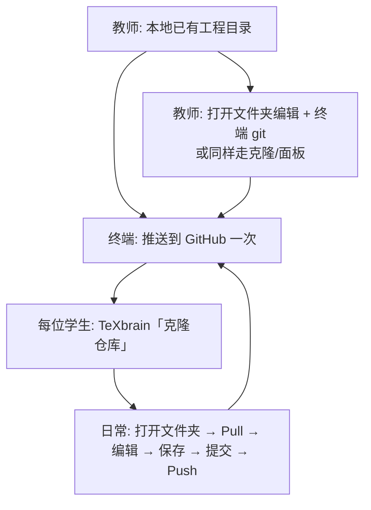

<p align="right"><a href="../README.zh-CN.md">文档索引</a> · <a href="../../README.zh-CN.md">主 README</a> · <a href="../en/collaboration-workflow.md">English</a></p>

# 多人协作流程（GitHub 与实时房间）

本文说明在 TeXbrain 中**师生多人改同一 LaTeX 工程**时，应如何以 **GitHub 为唯一真相源**，以及 **Collab 实时房间** 的适用边界。

> **前提：** 完整「打开本地文件夹 + 保存到磁盘」需要 **Chrome / Edge** 等支持 [File System Access API](https://developer.mozilla.org/en-US/docs/Web/API/File_System_API) 的浏览器。见 [常见问题 — 浏览器支持](faq.md#浏览器支持)。

---

## 先选协作方式

| 方式 | 适用场景 | 持久性 | 推荐角色 |
| --- | --- | --- | --- |
| **Git + GitHub**（本文主流程） | 作业、章节分工、评阅、异步改稿 | 提交在 GitHub，长期可追溯 | **课程主流程** |
| **Collab 房间**（WebRTC / Yjs） | 课堂同时改几段源码 | 关房间即结束；**不替代 Git** | 课堂补充 |

**不要混用为唯一手段：** 只开 Collab 而不 Push，别人下次打开看不到你的修改；只 Initialize 而不从 GitHub Clone，可能缺字体/图片且与远端历史不一致。

---

## 核心概念（避免误解）

TeXbrain 里有两套彼此独立的存储：

1. **磁盘工程目录** — 通过「打开文件夹」读写（Chrome 下可保存 `.tex`、`.otf` 等）。
2. **浏览器内 Git** — [isomorphic-git](https://isomorphic-git.org/) + IndexedDB（键名约为 `texbrain-git-<文件夹名>`），供 **Git 面板** 的 Pull / Commit / Push 使用。

重要事实：

- **打开本地已有 `.git` 目录，Git 面板不会自动识别** — 不会把磁盘上的 `.git` 导入浏览器。
- **Git 面板操作默认不写磁盘 `.git`** — 以 **GitHub 远程** 为共享中心时，每人用面板 **Push / Pull** 与 GitHub 对齐。
- **虚拟 Git 按「文件夹名」分区** — 改名文件夹或清浏览器站点数据后，需重新 **Clone** 或 **Initialize**。

技术背景见 [技术说明 — Git](technical.md#git)。

---

## 推荐总览（GitHub 为中心）



---

## 流程 A：以 GitHub 为主的课程协作（推荐）

假设教师本地已有工程，例如：

`…/bibtex-metapost-english-chinese/Bennett_Chow_2026_Introduction_to_Ricci_flow`

### 步骤 0 — 教师：把「真相」放到 GitHub

在终端进入工程目录（最稳妥，可带上完整历史与大文件）：

```bash
cd "/path/to/Bennett_Chow_2026_Introduction_to_Ricci_flow"
git remote -v                    # 确认 origin
git push -u origin main          # 分支名按仓库实际修改
```

若尚无远程：在 GitHub 创建空仓库 → `git remote add origin https://github.com/ORG/REPO.git` → 再 `push`。

**大文件：** 字体 `.otf`、大图等若超过 GitHub 单文件限制，需 [Git LFS](https://git-lfs.github.com/) 或调整资源策略；这与 TeXbrain 无关。

将 **HTTPS 克隆地址** 与 **默认分支名** 发给学生。

### 步骤 1 — 学生：第一次加入（每人一次）

1. 用 **Chrome / Edge** 打开 TeXbrain。
2. 欢迎页选择 **克隆仓库（Clone Repository）**，填入教师的 GitHub URL（可选分支）。
3. 选择本机**可写的父目录**；TeXbrain 会在其下**新建**子文件夹并：
   - 在浏览器 IndexedDB 中建立 Git（Git 面板可用）；
   - 将 **HEAD** 中的文件写入磁盘（含远程已跟踪的二进制，若克隆成功）。
4. 打开 **Git** 面板 → **Remote** 标签：
   - 填写 **Author name / email**；
   - 私有库填写 **Personal Access Token**；
   - CORS 代理可先用默认 `https://cors.isomorphic-git.org`。

> **不建议：** 对学生分发教师拷贝的 zip，再只做「打开文件夹 + 初始化仓库」——会在浏览器里新建一套与 GitHub 历史无关的仓库，且易漏二进制文件（见下文「Initialize 与 Clone」）。

### 步骤 2 — 日常协作（每人每次开工）

| 顺序 | 操作 | 说明 |
| --- | --- | --- |
| 1 | **打开文件夹** | 选自己 Clone 出来的**同一子目录**（文件夹名勿随意改） |
| 2 | **Pull** | Git 面板先拉再改，减少冲突 |
| 3 | 编辑 | 正常改 `.tex` / `.bib` 等 |
| 4 | **保存** | 写入本机磁盘（与面板 Git 无关，但必须保存） |
| 5 | **Stage → Commit → Push** | 推送到 GitHub |
| 6 | 他人 **Pull** | 下一位同学继续 |

### 步骤 3 — 教师自己的两种做法

| 方案 | 做法 | 优点 |
| --- | --- | --- |
| **A（简单）** | 继续用现有目录 **打开文件夹** 编辑；**Git 用终端** `pull` / `push` | 不折腾浏览器 Git；与学生共享同一 GitHub |
| **B（统一）** | 教师也用 TeXbrain **克隆仓库** 到另一本机目录，师生界面一致 | 全班都用 Git 面板 |

无论 A/B，**以 GitHub 上的提交为准**；不要假设「保存到磁盘」等于「已推送到 GitHub」。

### Token 与安全（课程建议）

- 学生 token 尽量 **只读** 或 **最小写权限**；写权限给**自己的 Fork**，不要给共享模板上游写权限。
- 详见 [常见问题 — 模板仓库与 Git](faq.md#模板仓库与-git)。

---

## 流程 B：课堂实时协作（Collab 房间）

用于**同时在线**改稿，不能代替 GitHub。

| 角色 | 操作 |
| --- | --- |
| **Host** | 先 **打开文件夹**（工程已在本地）→ 打开 **Collab** → 创建房间 → 将分享码发给学生 |
| **学生** | 输入分享码加入 → 实时看到编辑 |
| **下课前** | Host 或学生在 **Git 面板** 完成 **Commit + Push**（若已按流程 A 配置 Git） |

**限制：**

- 创建房间时只打包**文本类**工程文件（与扫描 `.tex` / `.bib` 等相同），**不包含** `.otf` / `.pdf` / 图片等二进制。
- 编译：Collab 模式下通常仅 **Host** 驱动完整编译；PDF 不会自动当作「作业提交」分发。
- SyncTeX：仅本机含 synctex 的编译可靠；见 [常见问题 — SyncTeX](faq.md#synctex编辑器--pdf)。

---

## Initialize 与 Clone：哪些文件会进 Git 面板？

| 操作 | 浏览器 Git 来源 | 典型包含 | 通常不包含 |
| --- | --- | --- | --- |
| **克隆仓库** | 从 GitHub 完整 clone 到 IndexedDB，再导出到磁盘 | 远程已跟踪的源码 + 二进制（字体、图等） | 未提交到远程的文件 |
| **打开文件夹 + 初始化仓库** | 扫描磁盘文本扩展名后 `git init` + 首次提交 | `.tex` `.bib` `.sty` `.cls` 等文本 | `.otf` `.pdf` `.png`、`.gitignore`（无匹配扩展名）、磁盘 `.git` |
| **仅打开文件夹**（未初始化、未克隆过） | 无 | — | Git 面板显示「不是 Git 仓库」 |

扫描规则见编辑器 `readDirRecursive`（文本扩展名列表）；以 `.` 开头的目录（含 `.github`）不会遍历。

**课程结论：** 要保证学生 **能编译、能协作**，应保证资源**已在 GitHub**，学生用 **克隆仓库**，而不是只靠 **初始化仓库**。

---

## 常见问题

### 打开本地 git 目录，面板仍显示「不是 Git 仓库」

正常。请对该工程使用 **克隆仓库**（从 GitHub），或在面板 **初始化仓库** 后添加 Remote 再 Pull（易与已有历史冲突，不推荐作课程默认）。

### 两人改了同一行

Git 面板可能出现冲突；在 Changes 中处理，或回终端用熟悉工具解决后，再在 TeXbrain **Pull**。

### 换了电脑或清了浏览器数据

对同一 GitHub URL 重新 **克隆仓库** 到新目录即可（旧 IndexedDB 中的虚拟 Git 不会跟着走）。

### 磁盘有 `git`，面板里也提交了，是否一致？

**不一定。** 终端 `git status` 与 TeXbrain Git 面板可能不一致。以 **GitHub** 为准时，统一约定：要么大家都用面板 Push/Pull，要么教师用终端、学生用面板，但都要 push 到同一 `origin`。

### Firefox / Safari 学生

可用编辑器与虚拟 FS，但**无法**像 Chromium 那样授权本地文件夹；课程建议统一 Chrome/Edge，或学生 Fork 后主要在 GitHub 网页端审阅 + 有 Chromium 的机器做 TeXbrain 编辑。

---

## 相关文档

- [常见问题 — 模板仓库与 Git](faq.md#模板仓库与-git)
- [技术说明](technical.md)
- [部署](deployment.md)（自托管 TeXbrain 站点时）
- [示例工程](../../examples/bibtex-metapost-english-chinese/README.md)
